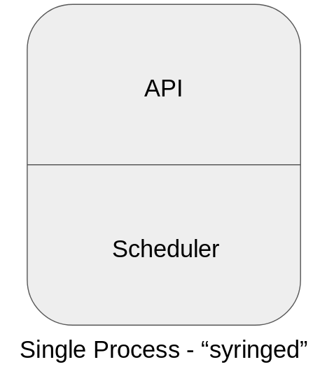
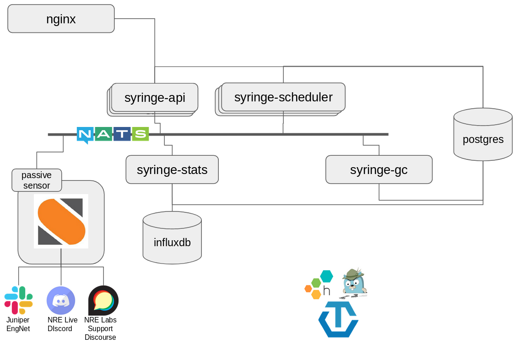

# MP1: Syringe Redesign

The Antidote platform requires a concerted effort in order to get it to what
could be considered a "1.0 architecture". As a key component to the platform, Syringe
requires a large portion of this focus. This document outlines the first mini-project
involved in this effort, titled "MP1".

The first portion of the document section can be read much like a design document. It's job
is to describe the intended "end state". The latter portion of the document will cover
the concrete steps and milestones for getting there.

First, an overview of the existing architecture, and a high-level overview of what we want
to change.

Advantages:
- Single binary
- No external database to worry about
- Allowed us to get NRE Labs public quick

Disadvantages
- Single point of failure
- Everything is tightly coupled, harder to extend
- State is kept in-memory, so restart means state is lost
- This means we need to kill all existing lessons on start
- Fairly opaque - all monitoring is custom

Proposed New Syringe Architecture

- Better resilience - no “one syringe”
- Easier to extend - just pop a new service on the message bus
- Easier to reason about, maintain, and contribute to individual services
- Totally stateless services - all state managed by a proper database.

## Design Area - Observability Instrumentation

Ensuring a Positive User Experience - Observability

Are users having problems
Monitoring components is easy, monitoring the full thing is hard?
If they are, what can we even do about it?
In the 0.01% of cases where users find a way to get feedback to us, all of the context is lost.

When to record spans? Receipt? Send? Both?

This is MOSTLY a syringe thing, but will also include changes in antidote-web
Threads:
- Component observability - Better structured logging (I haven’t been the most sanitary here) with option to send to remote collector
- System observability - Tracing from web front-end all the way through every syringe microservice. Allows us to leverage inherent cardinality based from initial session and request ID.

## Mini-Project Milestones

This mini-project is too large to take place within a single platform release. To facilitate ongoing stability,
and create logical steps to the end-goal, a set of milestones is listed below. These milestones should be done
in the order shown, and can be added to any platform release that is deemed suitable.

### MP1.1 - Move state to external database

(https://cloud.google.com/sql/ https://github.com/go-pg/pg, or perhaps consul)

### MP1.2 - Break out garbage collection

### MP1.3 - Break out TSDB

### MP1.5 - Separate API and Scheduler and implement message queue

### MP1.6 - Structured and centralized logging with Fluentd

### MP1.7 - Observability instrumentation

### MP1.8 - Syringe Security

Specifically things like rate limiting, source IP stuff, etc etc. Some should be built into the app, but other things we can offload to cloud security stuff I’d imagine at the infra layer - blocking known bad IPs, etc. Look at GCP security offerings

Message queue design. As long as there's a component to translate events to achievements
then we will pick them up. If not then we will configure the messages to time out and they just go nowhere. Allows us to just plug things into the bus to enable the functionality
The message queue + database is a common distributed systems model (see stackstorm)
Database = state management
Message Queue = you have some work to do
The database will PURELY be used for state management, so we can use a common source of state for all components, complete with all the necessary features like locking

The design allows us to enable or disable features simply by starting the relevant processes to listen on the message queue or the Syringe API. If we don't want to export to influx, we simply don't enable that process. If we don't want to enable gamification, don't start the translator process. All messages like this will be sent with a TTL, so if nothing is there to pick messages up off the queue, they'll disappear after a while.

Having state in an external component means we can allow everything else to be stateless.

The API can easily be stateless because it's just designed to translate API calls into message queue messages essentially, or perform reads on teh database. It won't make direct writes to the DB. As a result, this can scale out easily.

The scheduler can also scale out as long as we ensure only one of the instances of the scheduler takes a request off of the queue (i.e. no fan-out). However, the scheduler should still direct all incoming requests into a goroutine so that each individual scheduler process can handle multiple processes concurrently, just like it does today. In addition, since the scheduler will be writing to the database (as will the GC process), we need to make sure we can perform transactions on a per-UUID basis. Need to put more detailed thought into this part.

https://peter.bourgon.org/blog/2017/02/21/metrics-tracing-and-logging.html

Add syrctl import command to initiate reload of all content, or maybe partial content?

Add authentication to syringed/syrctl, and give certificates to everyone for PTR so they can re-import their stuff.

https://opentracing.io/specification/

Not easy to debug stuff
It is really, really hard to see a user’s path through the system right now with flat logs. Debugging problems is nearly impossible right now, because of two main insufficiencies
Not enough context is given for each log message.
Flat logging won’t give us any insight whatsoever into how well the solution is scaling. This will be especially true if we fix Problem #1, as we’ll invest time into breaking Syringe apart into microservices but with flat logs we’ll be operating blind.
Solution:
Logging is still good, but it needs to be structured, and it needs to be done in such a way that all the context is preserved, so we can filter on a UUID, for instance
Instrument the code for distributed tracing so that we can export traces to standardized distributed tracing tools like Jaeger and Honeycomb. This will allow us to take a piece of cardinal data (i.e. UUID) and see the end-to-end flow throughout the system.
OpenTracing is overwhelmingly the goto standard for distributed tracing, and is supported by numerous backends, including Jaeger, Honeycomb, Zipkin and more. https://opentracing.io/specification/

Traces will begin on receipt of requests, either in GRPC (below) or rest-gateway if possible
https://medium.com/@masroor.hasan/tracing-infrastructure-with-jaeger-on-kubernetes-6800132a677
https://github.com/grpc-ecosystem/go-grpc-middleware/
NATS can also be instrumented:
https://github.com/nats-io/not.go
Spans
Api-to-scheduler
Scheduler-to-st2
Etc - need to build a trace diagram on the whiteboard and copy it here.
Links
