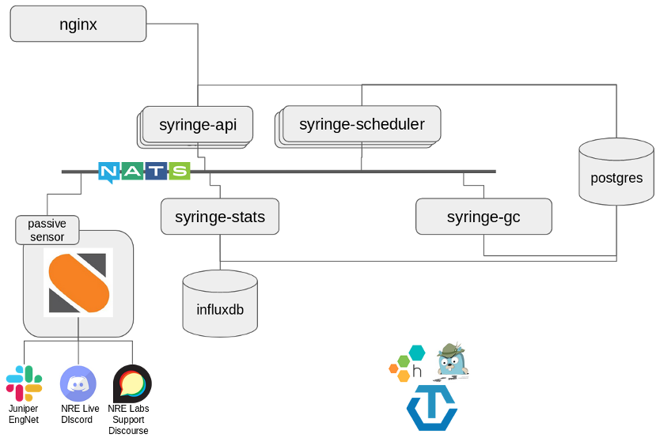

# MP1: Syringe Redesign

The Antidote platform requires a concerted effort in order to get it to what
could be considered a "1.0 architecture". As a key component to the platform, Syringe
requires a large portion of this focus. This document outlines the first mini-project
involved in this effort, titled "MP1".

The first portion of the document section can be read much like a design document. Its job
is to describe the intended "end state". The latter portion of the document will cover
the concrete steps and milestones for getting there.

First, an overview of the existing architecture, and a high-level overview of what we want
to change.

## Justification

In short, the existing Syringe design is monolithic, and we're going to break it up into individual microservices. To facilitate this, I'm doing a good amount of prototyping, and I quickly realized that covering my discoveries and experiences here would make a good blog post series.

### Monoliths are Okay

The existing architecture was intentional - the name of the game initially was getting a PoC out quickly, so that the community could get their hands on the project ASAP. It was demonstrably easier at the time to just place all functionality and state into a single binary and deal with the downsides.

On talking with others, it seems this isn't an uncommon choice - it's a tradeoff that may be worth considering if you have similar requirements. If, instead, I was building this for a business that required it to be stable from the outset, and couldn't tolerate a rewrite a year down the line, I would probably have made different decisions.

A year ago, the most important thing to do was to put **something** out there that showed the promise of curriculum-as-code, and publishing a reference curriculum (NRE Labs) that the community could start contributing to. Since we knew NRE Labs was never going to be a revenue-generator, it was okay for us to make short-term decisions that would otherwise seem crazy - things like keeping all state in memory in a single binary that would occasionally crash and wipe its own slate.

### Why Microservices?

In making every design decision, it has to come back to your requirements. For us, the requirements for this phase of things are pretty clear:

- Resilience is becoming more important. To create a stable platform for the community to rely on for learning infrastructure automation for the long-term, a 

It's very trendy right now to move to a microservices application architecture (or at least talk about it) so to avoid getting lumped in with the bandwagon crowd, let me spend some time talking about some of the reasons we're doing it here.

That said, we're clearly moving ahead with the rewrite to microservices, so here are some reasons:

- A year ago our chief consideration was getting the project off the ground quickly. Now, our chief consideration is to make it easier for folks to contribute to the Antidote platform. Breaking it up into different components means a lot less for folks to wrap their heads around at a time.
- The application is still pretty small, and the internal architecture is actually pretty compatible with the intended rewrite pattern with channels and NATS, so the pain is reduced. 

## High-Level Architecture

The current Syringe architecture is quite simple. It all compiles to a single binary: `syringed`, but is logically
built of two components - the scheduler, and the API server:

At start, this binary loads the entire curriculum into memory. It also maintains an internal map of
which lessons are active and what stage they're running, etc. In short, everything is contained within
this single program - both from a code perspective, as well as runtime state.

This simple approach has several advantages:

- Single binary, easy to deploy
- No external database to worry about
- Allowed us to get NRE Labs to a public PoC quickly

However, it also has some key disadvantages:

- `syringed` is a single point of failure
- Everything is tightly coupled, so extending Syringe's capabilities is more difficult.
- State is kept in-memory, so if Syringe is restarted, state is lost. This is why we currently kill
  all running lessons every time Syringe starts.
- Fairly opaque - all monitoring is custom, and relies primarily on good logs.

The new Syringe architecture being proposed in this document can be summarized in the following points:

- Breaking up the logical services currently offered within `syringed` into separate microservices.
- Move state to an external database of some kind (TBD)
- Add better logging and observability instrumentation to aid in better production debugging.

This design has some key advantages over the current approach:

- Better resilience - no “one syringe”
- Easier to extend - just pop a new service on the message bus. In the above diagram, we note that other
  non-Syringe software like StackStorm can listen on this event bus and further extend the capabilities of
  the platform.
- Easier to reason about, maintain, and contribute to individual services.
- Totally stateless services - all state managed by a proper database. This not only means managing state
  in the right way, it also means that Syringe microservices can scale horizontally, aiding in overall
  system resilience.

Database = centralized and external state management so the microservices can be light and stateless
Message Queue = notifying components that they have some work to do

The message queue + database is a common distributed systems model (see stackstorm).

### Design Area - External State

(https://cloud.google.com/sql/ https://github.com/go-pg/pg, or perhaps consul)

Having state in an external component means we can allow everything else to be stateless.

The database will primarily be used for state management, so we can use a common source of state for all components, complete with all the necessary features like locking

The API can easily be stateless because it's just designed to translate API calls into message queue messages essentially, or perform reads on teh database. It won't make direct writes to the DB. As a result, this can scale out easily.

The only thing we'll have to figure out is if we need to import lesson definitions into the database. On one hand, I like the idea of pure curriculum-as-code - meaning the files on the filesystem, cloned from the Git repo, are the source of truth. However, this would mean we'd have to be make sure that we have the same version of the curriculum always in the right spot for all the microservices, which may be on different machines.

On the other hand, we could do what StackStorm does with packs, which is to provide tooling to import a curriculum's "code" into database constructs. The microservices then access that data, rather than all of them accessing their own localized filesystems. The curriculum-as-code is still the original source of truth, but it's been placed into a centralized location for all to access.

Maybe a "syrctl import" command is needed to facilitate this.

Will also need a table for "locking" a livelesson. Any time an action is being taken on a livelesson, such as changing stage, or starting a new one, etc - a row should be added to this table with the value of the livelesson. Before starting any activity, this table is consulted, and if a value exists, do not take the action. Might be worth considering queuing actions but it's probably best to not do this, and outright reject them at the API layer if a livelesson is locked.

Need to figure out a way to represent a user ID that isn't bound to a specific platform. Like, we **think** we will
use Discourse but we may use any of the platforms in MP6. The data model should account for this.

### Design Domain - Microservices and Message Queue

Services:
- API
- Scheduler
- Garbage Collector
- Stats (influxdb)
- Objective-checker

NATS is the likely candidate for this. It's super simple and blazing fast.

------------------------
We'll need a centralized messaging package for:
- one place for services to publish messages to each other
- centralized message definitions
- centralized observability instrumentation for service-to-service comms. (will still need API to be instrumented)

Assuming we use NATS, I like the idea of [using native Go channels](https://github.com/nats-io/nats.go#using-go-channels-netchan)
to communicate between services. So, this package should offer a function where you pass in the config,
and it returns a struct containing all of the channels needed for inter-service communication. Each service
keeps track of this struct and whenever it needs to send or receive data, that struct will have a channel for
that need.

I believe NATS is our best candidate here. It's simple, fast, and built in Go (which Syringe is as well).

One decision we'll have to make is if we want to use plain old NATS, or if we think there's a case for
[NATS Streaming](https://nats-io.github.io/docs/nats_streaming/intro.html). I don't think we need the extra
features offered there, but am open to arguments otherwise. One thing that will help is figuring out the code impact - is there a difference in how we connect to NATS, or is this just an add-on to the server side of things?

I don't *think* we need NATS streaming - one reason is that each worker is designed to receive a message and spawn a goroutine to handle it, so we can scale within each running worker process, and we can also always spin up more than one worker process for additional responsiveness (and resiliency)

---------------

Message queue design. As long as there's a component to translate events to achievements
then we will pick them up. If not then we will configure the messages to time out and they just go nowhere. Allows us to just plug things into the bus to enable the functionality

The design allows us to enable or disable features simply by starting the relevant processes to listen on the message queue or the Syringe API. If we don't want to export to influx, we simply don't enable that process. If we don't want to enable gamification, don't start the translator process. All messages like this will be sent with a TTL, so if nothing is there to pick messages up off the queue, they'll disappear after a while.

The scheduler can also scale out as long as we ensure only one of the instances of the scheduler takes a request off of the queue (i.e. no fan-out). However, the scheduler should still direct all incoming requests into a goroutine so that each individual scheduler process can handle multiple processes concurrently, just like it does today. In addition, since the scheduler will be writing to the database (as will the GC process), we need to make sure we can perform transactions on a per-UUID basis. Need to put more detailed thought into this part.

> Maybe we could use NATS for this - when a stage is activated, a message will be sent to subscribers, which will include a set of `syringe-verify` services or something like that. The job of this service is to listen for lesson GC or stage change (or lesson start) events and add verification tasks as needed. It will maintain state for which <lesson>-<session>-<stage>-<objective> is being checked in which pod, and updating the back-end state accordingly. The API simply periodically checks the state.

https://micro.mu

Objective complettion is also an event that should eventually be sent out on the message queue.

### Design Area - Observability Instrumentation

Are users having problems?
Corollary: monitoring components is easy, monitoring the end-to-end user experience is hard.

If they are, what can we even do about it?
Corollary: In the 0.01% of cases where users find a way to get feedback to us, all of the context is lost.

When to record spans? Receipt? Send? Both?

This is MOSTLY a syringe thing, but will also include changes in antidote-web
Threads:
- Component observability - Better structured logging (I haven’t been the most sanitary here) with option to send to remote collector
- System observability - Tracing from web front-end all the way through every syringe microservice. Allows us to leverage inherent cardinality based from initial session and request ID.

https://peter.bourgon.org/blog/2017/02/21/metrics-tracing-and-logging.html
https://opentracing.io/specification/

Not easy to debug stuff
-It is really, really hard to see a user’s path through the system right now with flat logs. Debugging problems is nearly impossible right now, because of two main insufficiencies
-Not enough context is given for each log message.
-Flat logging won’t give us any insight whatsoever into how well the solution is scaling. This will be especially true if we fix Problem #1, as we’ll invest time into breaking Syringe apart into microservices but with flat logs we’ll be operating blind.
Solution:
-Logging is still good, but it needs to be structured, and it needs to be done in such a way that all the context is preserved, so we can filter on a UUID, for instance
-Instrument the code for distributed tracing so that we can export traces to standardized distributed tracing tools like Jaeger and Honeycomb. This will allow us to take a piece of cardinal data (i.e. UUID) and see the end-to-end flow throughout the system.
-OpenTracing is overwhelmingly the goto standard for distributed tracing, and is supported by numerous backends, including Jaeger, Honeycomb, Zipkin and more. https://opentracing.io/specification/

Traces will begin on receipt of requests, either in GRPC (below) or rest-gateway if possible
-https://medium.com/@masroor.hasan/tracing-infrastructure-with-jaeger-on-kubernetes-6800132a677
-https://github.com/grpc-ecosystem/go-grpc-middleware/
-NATS can also be instrumented: https://github.com/nats-io/not.go

Spans
-Api-to-scheduler
-Scheduler-to-st2
-Etc - need to build a trace diagram on the whiteboard and copy it here.
-Links

**ALSO** - will definitely need to do better about reporting errors from Syringe. And as a side note, in production we should ensure these are surfacing to someone.

### Design Area - Lesson Networking

The existing model works well but has shortcomings.
In this project we should evaluate NetworkServiceMesh and figure out if it suits our needs.

## Mini-Project Milestones

This mini-project is too large to take place within a single platform release. To facilitate ongoing stability,
and create logical steps to the end-goal, a set of milestones is listed below. These milestones should be done
in the order shown, and can be added to any platform release that is deemed suitable.

This document will be updated as these milestones are achieved, with links to the Pull Request(s) and/or
that satisfy them.

### MP1.alpha - Move to go modules

### MP1.1 - Move state to external database

### MP1.2 - Break out garbage collection

### MP1.3 - Break out TSDB

### MP1.5 - Separate API and Scheduler and implement message queue

### MP1.6 - Structured and centralized logging with Fluentd

Will this also include error reporting?

### MP1.7 - Observability instrumentation

### MP1.8 - Syringe Security

No need to go overboard here because we are running behind cloudflare in prod, but some common sense
measures should be taken, especially since not everyone will be running behind cloudflare.

Specifically things like rate limiting, source IP stuff, etc etc.

