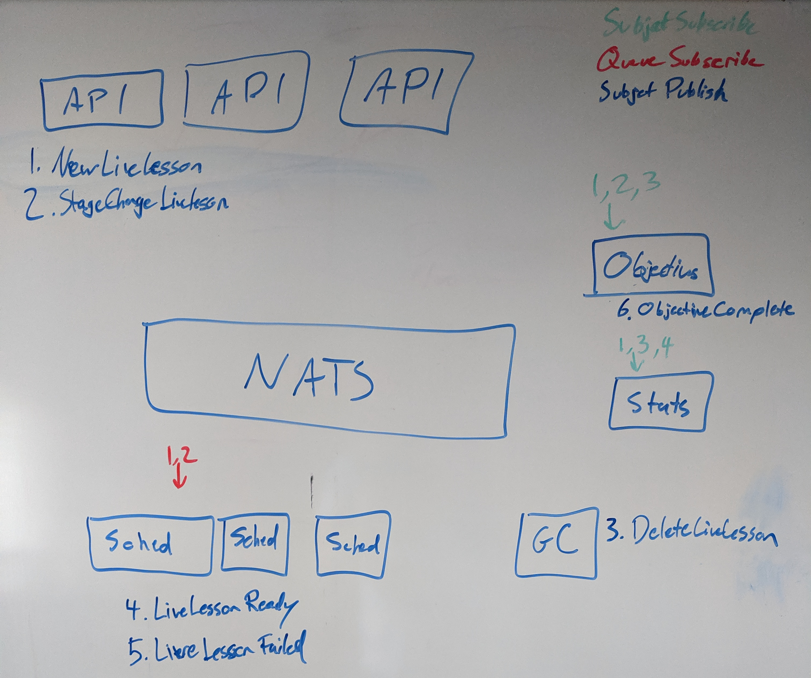

# Antidote v1.0 Mini-Project 1 - Platform Redesign

The Antidote platform requires a concerted effort in order to get it to what
could be considered a "v1.0 architecture". As a key component to the platform, Syringe
requires a large portion of this focus. This document outlines the first mini-project
involved in this effort, titled "MP1".

The first portion of the document section can be read much like a design document. Its job
is to describe the intended "end state". The latter portion of the document will cover
the concrete steps and milestones for getting there.

> **NOTE** - this is NOT intended to describe the final state of the Antidote platform. v1.0 plans are just that - v1.0 plans. The point of this effort, in large part, is to make it easier to make future changes to Antidote, and not to get all those changes in now.

## Existing Architecture and Historical Design Requirements

A year ago, the most important thing to do was to put **something** out there that showed the promise of
curriculum-as-code and fully automated on-demand lessons, so that the community could start rallying around (and start
contributing to) a reference curriculum (NRE Labs). Since we knew NRE Labs was never going to be a revenue-generator,
it was okay for us to make short-term decisions that would otherwise seem crazy - things like keeping all state in
memory in a single binary that would occasionally crash and wipe its own slate.

The existing monolithic architecture of Syringe was intentional - the name of the game initially was getting
a PoC out quickly, so that the community could get their hands on the project ASAP. The important parts of Syringe
weren't how well it scaled, or how easy it was to understand or extend - it was the abstraction offered
to lesson authors, and how well it automated the setup of new lesson resources on behalf of the user. This is what
conveyed the value of the platform, and scalability and stability frankly didn't really matter that much at the time.
The more important mission was to prove the viability of the project as a whole, and nail the abstraction we offered
to lesson builders.

The current Syringe architecture is quite simple. It all compiles to a single binary: `syringed`, but is logically
built of two components - the scheduler, and the API server:


At start, this binary loads the entire curriculum into memory. It also maintains an internal syringemap of
which lessons are active and what stage they're running, etc. In short, everything is contained within
this single program - both from a code perspective, as well as runtime state.

This simple approach has several advantages:

- Single binary, easy to deploy
- No external database to worry about
- Allowed us to get NRE Labs to a public PoC quickly

However, it also has some key disadvantages:

- `syringed` is a single point of failure
- Everything is tightly coupled, so extending Syringe's capabilities is more difficult.
- State is kept in-memory, so if Syringe is restarted, state is lost. This is why we currently kill
  all running lessons every time Syringe starts.
- Fairly opaque - all monitoring is custom, and relies primarily on good logs.

## Deprecation of "Syringe" Name

Before we get too far into the new design, we first have to tackle the topic of, sadly, we're parting ways with
the name "Syringe".

For a while, we've referred to the entire platform (including the web UI) as "Antidote", even though Antidote isn't really a tangible thing. We've gotten around this by saying that it's an umbrella term, much like Openstack, and that the tangible subcomponents, namely `antidote-web` and `syringe`, make this up.

However, given that Syringe contains the vast majority of the functionality of the platform, having a separate
name, while certainly cool and well-aligned to the theme of the project, offers nothing but confusion.
So, before work begins on this project, we will be renaming Syringe to conform to the Antidote terminology, which
is already the primary terminology we use when explaining the platform to newcomers anyways. Here's a list of
things we'll want to do to facilitate this change.

- The `antidote-web` repository will remain unaffected, as it is already appropriately named.
- The `syringe` repository will be renamed `antidote-core`, to reflect the nature of the services that will be
  housed there.
- The microservices that run within the Antidote core platform will be prefixed with `antidote-`, to further
  align them with the Antidote name. Each service will be represented by a compiled binary that's named thusly.
- The `antidote` repository will be renamed `antidote-docs`, and will be updated to replace all references to
  Syringe as needed.

With these changes, all platform elements will fall under the name "Antidote", even across repositories. While `antidote-web` will still be maintained in a separate repository because the technology behind it is different, it really is just another service of the Antidote platform, as is `antidote-api`, and so on.

Throughout the rest of this document, we'll be using the term "Antidote", instead of Syringe, unless we're discussing
existing/legacy functionality. If a particular service is being discussed, it will be called out by name, such
as `antidote-web`, or `antidote-api`.

## High-Level Overview of Antidote v1.0 Design

There are a few things that we have learned since we started the project, and together, they're driving the
need for a new architecture:

- Usage of NRE Labs is growing rapidly, and we're encountering use cases that will rely more heavily on its
  availability. An architecture that tolerates failures and scales seamlessly is needed.
- Increasingly, our community wants to work with Antidote directly, and it's important that we invest more time in
  making it not only easy to understand, but also easy to operate, and easy to extend.

This new Syringe architecture - which will be outlined in detail in this document - can be summarized in
the following points:

- Breaking up the logical services currently offered within `syringed` into stateless, horizontally
  scalable microservices, connected via standard communication platforms like pub/sub messaging and HTTP.
- Manage all state via an external database. All microservices will be totally stateless.
- Add observability instrumentation to aid in better production debugging and proactive awareness of user experience


The "message bus + database" design is a popular and well-understood distributed systems pattern. Projects
like [StackStorm](https://github.com/StackStorm/st2) use this architecture to get the best of both worlds.
In short:

- The database is used for managing state, so that all services can be stateless, and can operate without worrying
  about stepping on each other (database will handle locking and transactions).
- The message bus is used to notify various components that they have work to do. Antidote services will listen
  for certain message types so they know when they need to perform certain operations (pub/sub).

This design has some key advantages over the current approach:

- **Better Resilience** - There's now no “one syringe”. All services are stateless, so the important services
  like the scheduler or the API can be horizontally scaled for HA.
- **More Extensible** - The events sent on the bus are well-known, and any software can subscribe to
  those events without Syringe even knowing about it.
- **Easier to Understand** - It will be easier to reason about, maintain, and contribute to individual services.

## Design Detail

Now that the high-level design is out of the way, there are a number of specific design areas that should be
explored in further detail (in no particular order - the end of this document will overview a proposed execution
plan).

### Antidote API

The database changes we'll discuss later are causing us to re-evaluate the API models currently in-use.
Before we just rewrite in the current model, it's worth re-evaluating if gRPC and protobuf is really working
for us, or if we should consider a change. One thing is clear - using grpc-gateway is mostly pointless in our
case. We should go pure gRPC or pure REST.

We originally selected gRPC so we could use streaming RPCs to do further integration. Since we're using 
NATS under the hood next, we don't need this at the API level anymore. So that's one pro-gRPC argument off
the table.

There are plenty of [articles](https://nordicapis.com/when-to-use-what-rest-graphql-webhooks-grpc/) that explain
some of the high-level differences between various programmability options, but here's a list thats relevant to
this project

| Pros for REST  | Pros for gRPC |
| ------------- | ------------- |
| Supporting media natively instead of through URLs  | Go has great gRPC and protobuf tooling, and Syringe already has a lot built to use this already. |
| REST/HTTP APIs are more widely understood than gRPC/protobuf, which makes our contributor pool larger. Remember, making this project more accessible is a chief concern for this redesign.  | gRPC and protobufs are much more efficient than traditional HTTP APIs with JSON |
| More mature load balancer support  | --- |

> There is a new [standard for gRPC in Javascript](https://github.com/grpc/grpc-web), but it's still new, and I've heard it's not quite ready for primetime.

At this point, though I love gRPC and protobuf, and I will continue to use it in my other projects, it seems
that it's not as useful in this project. Fortunately, Go has really good built-in HTTP support. However, to
properly replace what we already have and set us up for success in the long-term, we'll need a few things.

- **An OpenAPI-compatible swagger definition** (the existing protobuf definitions can serve as a source of inspiration)
- **Auto-generated client and server functions** - it *seems* like [go-swagger](https://github.com/go-swagger/go-swagger) is the current preference for generating server and client code in Go for OpenAPI/Swagger. That repo's README has some notes on why [swagger-codegen](https://github.com/swagger-api/swagger-codegen) is a less desirable choice for this. The [docs](https://goswagger.io/faq/) for `go-swagger` will also be useful.
- **Built-in routing** - go-swagger has built-in routing that's simple and makes use of the already very good net/http support in Go. Ideally the routing would be fully automated so we can hook it up to the automatically generated code instead of statically matching paths to functions.
- **Auto-generated swagger docs** - (and endpoint for the swagger UI) - this is actually already being done in the existing grpc-gateway implementation so this just needs to be re-implemented in the new API service.
- **Dedicated API types** - With the new separate data model for the underlying database types, we can make the API way more simple. There's a lot in the current API that just doesn't need to be there because it's the only place we're storing Antidote types in the code. This will allow us to make the API much more simple and as a result, move towards stability.

Fortunately, it looks like [Netlify](https://github.com/netlify/open-api) has followed much of the above, so
we can borrow some ideas from their implementation for this.

While much of the functionality in general might remain the same, we should take the opportunity to really think through the API as if we were writing it from scratch, because we essentially are. Since we aren't using one model for everything, our data models for the API can be exactly purpose-built, so every field should be considered thoughtfully.

In addition, some big lessons-learned that should be reflected in the new design of the API:

- We are providing for facilities in the database for generating and storing session IDs within the platform, instead of leaving it up to the web client (which is currently how its done). So, the new API should have an endpoint for getting a token/uuid, and it's only good for so long. This is also where you can bake in some security - it's like an auth endpoint but without username/passwords, but it will have rate-limiting (number of UUIDs/IP address, and number of lessons per uuid, etc)
- The lesson optional objective verification portion of the API can probably just die. The data model for querying livelesson state should provide the functionality to see what objectives, if any, of a lesson have been satisfied.

### External State Management in a Database

One of the most fragile parts of the existing model is that all state is held in memory. On startup, Syringe loads lesson resources like lessons and collections into memory from the source YAML files. Once loaded, these don't change, they're just referenced. However, there are some fields in the API server as well as the scheduler that are used for ongoing state management, specifically to track what lessons are live, and what resources were created within each. Below is a list of all locations within Syringe where state like this is currently managed:

- [KubeLabs](https://github.com/nre-learning/syringe/blob/e903877229b48d600b06e397454be3225d657956/scheduler/scheduler.go#L63)
- [LiveLessons](https://github.com/nre-learning/syringe/blob/e903877229b48d600b06e397454be3225d657956/api/exp/server.go#L38)
- [VerificationTasks](https://github.com/nre-learning/syringe/blob/e903877229b48d600b06e397454be3225d657956/api/exp/server.go#L43)
- [GcWhiteList](https://github.com/nre-learning/syringe/blob/e903877229b48d600b06e397454be3225d657956/scheduler/scheduler.go#L61)

As part of this project, we'll be moving all tracked state to a proper database. This will let us not only keep
the services much simpler, it also helps coordinate work across multiple service replicas, where appropriate.

Currently, all data models in Syringe are defined as protobuf messages. This was initially done so we could
use a central resource to define the types in use throughout the codebase while simultaneously providing
a basis for providing access to that data programmatically via gRPC. We also made use of the
[`protoc-gen-validate`](https://github.com/envoyproxy/protoc-gen-validate) tool to provide basic validation
functionality (ensuring strings are a certain length, etc) when importing these resources from files.

While this model worked well for the first year of the project, it has a few problems, the largest of which is that
there are a lot of fields present in our protobuf definitions that don't need to be part of the API - they're
only there because the protobuf definitions are currently our central resource for all important types like
Lessons and Collections. This makes the API overly complex because these models need to satisfy both internal
and external needs.

It's not uncommon in software like this to have a dedicated set of models appropriate for database interactions,
and then a separate set of models for use in the API, which keeps the API much more simple and stable. The
database models are able to contain much more granular data, and can be refactored without impacting the API much
more easily. This is what we'll do in Antidote.

To facilitate this, we'll develop a new `db` package, which will require two efforts:

- Define and maintain [the full set of database models](https://github.com/go-pg/pg/wiki/Model-Definition)
  as native Go structs. These will be dedicated for this purpose. The API will be responsible for retrieving
  these types via `db` functions and translating to API types.
- Centralized database interaction functionality so that we don't have database calls all over the codebase.
  Since we're treating the `db` package as its own entity that doesn't have to worry about the API, we can be verbose
  here. Functionality to do standard CRUD updates for all types makes sense, as well as maybe other helper functions
  that might be necessary for the various Antidote core services.

The database models will likely need to be decorated with tags appropriate to the ORM in use. We'll be using Postgres, as it is an incredibly stable and well-supported database, and the [`go-pg`](https://github.com/go-pg/pg) is a very popular ORM for Go. The initial models will be built to work with these technologies primarily.

<!-- We are working on [a new database schema](https://dbdiagram.io/embed/5dae815e02e6e93440f27a53) for Antidote (currently WIP), and a full diagram will be embedded here once finished. -->
<!-- <iframe width="560" height="315" src='https://dbdiagram.io/embed/5dae815e02e6e93440f27a53'></iframe> -->

The set of database models is likely to go through future changes as it continues to be used. In most applications, schema changes should be managed carefully, so that when the software changes, the database can be migrated seamlessly. Usually this is done by maintaining schema versions in code as ORM structures, as well as migration functions to convert the database to the new format. In our case, this will not be necessary; the new database schema really contains two types of data:

- **Curriculum Resources** - these will be pulled directly from the filesystem on import
- **State Tracking** - running lessons, sessions, etc

> Regarding the curriculum resources now being stored in the database - we are **not**  moving away from the curriculum-as-code model. The curriculum as represented in Git is still the source of truth, but rather than having each service maintain their own locally cloned Git repository (a sure operational headache), a new `syrctl import` command will be developed to import a curriculum into the database, and all services will just read from there. This is identical to what [StackStorm](https://github.com/StackStorm/st2) does with Packs.

None of this data is actually important enough to spend time on migration scripts to preserve it across versions. State tracking is very temporary, and curriculum resources are populated from a Git repository on the filesystem on import. Operationally, it's not only feasible but in fact far easier to simply recreate the database when moving between versions of Antidote, than it would be to maintain versioned schema definitions and migration scripts. So, Antidote will store its version into the `antidote_meta` table when initialized, and each service will check this value on startup to ensure it matches their own version. When a new version of Antidote is deployed, a one-time database initialization should be run, which will include the import of curriculum resources.

> I am not sure we can get away entirely with putting all curriculum definitions into the database. There are a lot of files in a lesson that have nothing to do with DB types. Configuration files, scripts, verification scripts, etc. Creating a model for Antidote definitions should still definitely be done, as this will enable us to create better tooling for creation/maintainance of curriculum resources, but it's likely that we'll still have to do something with init containers, at least at the pod level. Maybe this change will just mean we don't have to do it in two places like we're doing today.

This document will not drill into the actual schema definitions themselves, as these will be done as part of the proposed implementation in a pull request. However, at a high level, the following tables can be expected to be part of this:

- **antidote_meta** - k/v table for storing information about the version of Antidote that is working with this data
- **antidote_resource_collections** - storing collection definitions. This should only be written to on curriculum load - the rest of the time it will just be read.
- **antidote_resource_lessons** - storing lesson definitions. This should only be written to on curriculum load - the rest of the time it will just be read.
- **antidote_state_livelessons** - tracking active lessons, including any optional objectives, and their status
- **antidote_state_sessions** - Antidote will generate [unique UUIDs](https://github.com/nre-learning/proposals/pull/3#issuecomment-558008802) for sessions via the API, and store that session data here. We don't track specific users, but we should be storing enough data about the requestor to prohibit some of the more basic forms of abuse, like source IP (v4/v6). This is no more than is already being collected, and this will only be used for purposes of abuse prevention.

> VerificationTasks and KubeLab as mentioned at the top of this section are no longer needed, and do not have a place here.

Once these models and standard CRUD are in place, the functionality around importing curriculum resources needs to be re-vamped, especially regarding validation. The existing tool for validating protobufs will no longer be relevant, so a [new validator library](https://github.com/go-playground/validator) should be used here. In addition to validating import, we should [add tooling to create resources](https://github.com/nre-learning/syringe/issues/84)  based from these models. It shouldn't be too hard to build this once, and then the wizard will iterate through all available fields in a model to produce the desired UX. Creating new resources is currently one of the worst experiences in the platform, so we should spend some time thoughtfully working through the UX of the client.

Helpful reading:

- [How I use Postgres with Go](https://jbrandhorst.com/post/postgres/)
- [Simple API backed by PostgresQL, Golang and gRPC](https://medium.com/@vptech/complexity-is-the-bane-of-every-software-engineer-e2878d0ad45a)

### Microservices and Pub/Sub Messaging

Where Syringe historically has performed all functionality within a single running process, in the new Antidote
architecture, there are a number of services that will run as separate processes, each performing a specific task:

- `antidote-api`
- `antidote-scheduler`
- `antidote-gc`
- `antidote-stats`
- `antidote-checker`

These will all be discussed in detail below.



These services need to communicate with each other to be effective. As an example, the API service receives a request, it will need to inform the scheduler service that there's work to do (e.g. spin up kubernetes resources for a new lesson). To facilitate this, we'll use the [NATS messaging platform](https://nats.io/), as the nature of Antidote's inter-service communication aligns well with the publish-subscribe messaging model that NATS provides. NATS is also written in Go, and built to be extremely fast, and simple. [This blog post](https://storageos.com/nats-good-gotchas-awesome-features/) does a good job of covering the pros and cons of using NATS.

> [NATS Streaming](https://nats-io.github.io/docs/nats_streaming/intro.html) is a project that's designed to fit on top of plain NATS to provide some message reliablity features like buffering when there are no subscribers. While this sounds nice, I believe we can get away with plain NATS, and avoid using NATS Streaming, which will ensure that we don't start relying on it as a crutch. All services that absolutely must receive messages will have multiple copies, and will handle all incoming messages in a goroutine, meaning there will always be a subscriber available to receive incoming messages. As an added protective measure, we may look to leverage [request reply](https://nats-io.github.io/docs/developer/concepts/reqreply.html); as an example, if the API sends a message to the scheduler and it's not acknowledged, we can mark a livelesson as failed in the database. Combined, these tools should allow us to avoid relying on message buffering solutions and keep the messaging layer that much simpler.

Antidote will maintain a set of Events, modeled as Go structs but encoded as JSON on the wire, which will be
published onto NATS:

1. `NewLiveLesson`
2. `StageChangeLiveLesson`
3. `DeleteLiveLesson`
4. `LiveLessonReady`
5. `LiveLessonFailed`
6. `ObjectiveComplete`

Each event will get its own NATS subject. This will make it a lot easier to integrate external systems into Antidote,
as a third-party software system will only need to subscribe to the relevant subject, and a copy of each event will
be sent to them. It also makes it easy to disable functionality - since messages are not preserved if there are no
subscribers, we can disable functionality by simply not starting the relevant service.

Next, we'll describe each Antidote service, and discuss how they behave as it pertains to messaging (Note that each
service will perform DB reads):

> This document won't specify subject names, but during implementation, these should be written with a hierarchy that groups similar messages together. This will allow subscribers to receive the messages they want more easily.

#### `antidote-api`

| []()  |  |
| ------------- | ------------- |
| Writes to DB          | Yes |
| Subject Subscriptions | None |
| Queue Subcriptions    | None |
| Publishes             | 1,2 |

#### `antidote-scheduler`

| []()  |  |
| ------------- | ------------- |
| Writes to DB          | Yes |
| Subject Subscriptions | None |
| Queue Subcriptions    | 1,2 |
| Publishes             | 4,5 |

#### `antidote-gc`

| []()  |  |
| ------------- | ------------- |
| Writes to DB          | Yes |
| Subject Subscriptions | None |
| Queue Subcriptions    | None |
| Publishes             | 3 |

#### `antidote-stats`

| []()  |  |
| ------------- | ------------- |
| Writes to DB          | No |
| Subject Subscriptions | 1,3,4 |
| Queue Subcriptions    | None |
| Publishes             | None |

#### `antidote-checker`

| []()  |  |
| ------------- | ------------- |
| Writes to DB          | No |
| Subject Subscriptions | 1,2,3 |
| Queue Subcriptions    | None |
| Publishes             | 6 |

We'll need a centralized `comms` package to give the various Antidote services a single place for:
- Event Definitions
- Constructor functions for setting up [communication channels](https://github.com/nats-io/nats.go#using-go-channels-netchan)
- Observability Instrumentation (covered in a following section)

> [This blog post](https://keepingitclassless.net/2019/10/keeping-nats-connections-dry-in-go/) was written precisely as a prototype for how this will be laid out in Antidote, so please use it as guidance for how this package should be built. There's one possible exception to this, which is that the use of channels may get in the way of tracing instrumentation, so the use of normal functions for pub/sub is probably fine.

We'll also want a StackStorm sensor that listens for all events, and registers each within StackStorm as a trigger
that we can then integrate with other systems.

> We **should** be able to implement this comms package before even breaking Antidote up - as the `scheduler` and `api` portion of Antidote today communicate directly and those events are maintained in code. We could replace those with a `comms` package before breaking the services apart. However, the value of doing this is debatable, since we're not planning to run Antidote in prod until all of these milestones are finished.

Further Reading:

- https://building.echo.co.uk/microservices-opinions-and-advice/
- https://solace.com/blog/experience-awesomeness-event-driven-microservices/

### Objective Verification

One thing that wasn't thought of in the original proof-of-concept for this platform was the idea of including optional
objectives for the learner to accomplish. While anything is possible, since it's an on-demand learning platform,
it's nice to have some idea that you've accomplished the thing you've set out to learn.

We've played around with bolt-on feature additions that accomplish this in prior versions of the platform, but they're not implemented well, and part of that is due to architectural limitations. Now that Antidote will be based on pub/sub microservices, this becomes much easier to implement.

#### Learner Experience

For the learner, this will manifest itself fairly simply. Each stage may or may not contain optional objectives for them to perform. This adds a layer of activity beyond the current "next, next, next..." approach of the current lessons, and inspires the learner to actually DO something. I imagine having this feature in place will allow us to create lessons that are essentially half-finished - the idea being that the learner would complete a fabric configuration, or remediate a problem, etc.

To indicate that a given stage includes optional objectives, there will be some kind of button in the lesson UI that will indicate something like "0/3 objectives completed". When clicked, this button will pop up a modal box that explains each objective, and will contain a green check mark next to any objectives that are completed. At a glance, either at the button, or at this dialog, the user should be able to see what they still need to do.

When all objectives are completed, the button will glow or flash indicating full completion. The aforementioned dialog will show a message that is defined by the lesson author in the lesson metadata. We could also provide buttons for sharing the accomplishment via social. In the future, additional integrations with external systems may also be possible, but for the initial feature, we'll leave it at this.

#### Lesson Author Experience

Objectives are defined per-stage. So, at the very minimum, if a lesson author wants to take advantage of this feature, they need to add the `objectives` field as below. This field should have a list of strings for a value, and that list must be greater than 0. If the author doesn't want to use this feature, just leave the field out (this is what's true today).

```yaml
stages:
  - id: 1
    description: Stage 1
    verification:
      objectives:
      - The vqfx must have BGP configured
      - The linux endpoint must have a text file in the antidote user directory called "foobar"
      completeMessage: Congrats!
```

The presence of a nonzero list of `objective` entries will cause syringe to perform additional checks on the lesson directory. Each stage that uses this feature needs to have a `objectives` directory, and within that directory must be a Python script for checking if that objective is met within the lesson environment.


This is true of any stage that uses this feature. The lesson import functionality in the `db` package will be augmented to incorporate automated checks to ensure the right files are in place.

#### Back-End Implementation

Antidote-web will need to be updated to take advantage of this functionality, but since most of the work is being done by the core services, this should be fairly straightfowrard. The status of each objective will be added as a field to the existing livelesson API, so from a front-end perspective, we just need to periodically check the livelesson API (which is already done when waiting for lessons to start) and update any front-end UI elements as described above in the "learner experience" section accordingly. We'll need a new button, and a new dialog to contain the objective statuses. These will be hidden by default, and shown if the livelesson API contains any objective statuses, since this is the indication that they're defined in the lesson stage.

As shown in a previous section, a message will be sent onto the message bus when new lessons or stage change events take place. These are sent by the `antidote-api` service. This service will be responsible for looking at the lesson definition to see if optional objectives are included, in which case it will send a second, separate message to a dedicated subject for the `antidote-checker` services to listen on a queue for. The job of this service is to listen for lesson GC or stage change (or lesson start) events and start the process for ongoing verification of that lesson in a goroutine.

> TODO(mierdin): Put more thought into how the checker service receives notifications of new, changed, or deleted lessons. If we do it through comms, we have to think through all the messages, and it likely needs its own subject (since it can't listen on the same queue that the scheduler is listening on). We could also just not listen at all to NATS and instead just look at active livelessons in the DB directly.

Within this goroutine, the checker service will spin up a pod with the `objective-checker` (this is an image we'll define in https://github.com/nre-learning/antidote-images) image for every optional objective defined in the stage.  This pod will repeatedly run the corresponding Python script in the lesson directory. So for the pod spun up for stage 1 objective 2, we'll execute `stage1/objectives/objective1.py` in a goroutine. This will repeat for every objective.

`antidote-checker` will maintain state for which <lesson>-<session>-<stage>-<objective> is being checked in which pod, and updating the status in the relevant `livelesson` entry in the DB. This will allow the livelesson API to be updated accordingly, and in turn, the web UI.

Each objective will have one of three statuses:

- Incomplete
- Complete
- Error

We'll definitely want clean-up activities for both stage changes and lesson GC events. We may also consider shutting down all verification pods the moment all objectives are verified.

### Observability Instrumentation

When it comes to operating an Antidote-based service like NRE Labs, there are two questions we
currently don't have very good answers to:

- **Are users having problems?** - We just have no insight at all into the current user experience beyond testing it ourselves in real-time. There are several issues [like this one](https://github.com/nre-learning/nrelabs-curriculum/issues/274) that, while seemingly rare, do significantly affect the user's ability to start a lesson, and it's impossible to know exactly how often this happens.

- **If they are, what can we even do about it?** - In the 0.01% of cases where users find a way to get feedback to us, all of the context is lost. Someone might find a way to tell us that such and such a lesson isn't working, but reproducing the problem is almost always difficult - many issues, especially with the content, are intermittent.

The only thing we have right now to even hope to solve these problems are a smattering of log messages throughout
the codebase, most of which are not written meaningfully, and do not contain anything remotely like the correct
amount of context necessary to identify or reproduce the problem. Currently, the Syringe logs are rarely even
inspected, due to the fact that most of what we care about is highly context-dependent. Having everyone's
experience bleeding together in a single log file is not conducive to drilling into a specific problem.
If we're going to break the old Syringe up into the new Antidote microservices, this problem will be made even worse, because it will be not just one pointless log file, but rather several that we'll have to ignore.

In nearly every case, what we've been trying to get logs to help us with is to help us understand a user's path through the system, and how they fared along that journey. We've wanted to be able to identify bottlenecks across the entire system, and be able to provide this end-to-end view, applied to a very specific interaction, that may have taken place days ago. These can be best described as request-scoped events, as described in [this excellent blog post](https://peter.bourgon.org/blog/2017/02/21/metrics-tracing-and-logging.html).

On clarifying this need, it becomes obvious that [distributed tracing](https://opentracing.io/docs/overview/what-is-tracing/) is much better suited to solve this problem. Spans with rich metadata through tags and event timing through span logs will get us 99% of the way there. Leave standard logging for really catastrophic stuff like crashes.

For maximum compatibility, we'll make sure that the tracing implementation we select is compliant with
[OpenTracing](https://opentracing.io/). This is supported by a number of open source
collectors like Zipkin and Jaeger, as well as commercial and hosted offerings. Since a large number of inter-service
interactions will take place via NATS, it makes sense to use [not.go](https://github.com/nats-io/not.go),
but other implementations may also be appropriate, such as one that is best suited for initializing spans
for inbound API requests. `antidote-web` will also have to have instrumentation added, and the Antidote API will
have to be aware of this and be ready to pick up that rich inbound context.

Once this is done, an administrator should be able to take a few key identifiers, like session ID, lesson ID, etc.
and be able to see in detail, every interaction throughout the entire system, with specific in-span event logs
that show what's taking place inside each component.

The [OpenTracing best practices guide](https://opentracing.io/docs/best-practices/) should be regularly consulted
to ensure we're adding this instrumentation in an idiomatic way.

> As part of this effort, the creation of additional tooling, external to Antidote, may be necessary to create
some basic alerting or error reporting functionality. Some collectors seem to offer this, but it will also be
necessary to automate the forwarding of certain undesirable states to an administrator. This will likely take
place within the `antidote-ops` repository, but this combination of an OpenTracing collector and any additional
alerting tooling on top will be relevant to any that wish to use Antidote.

As a result of this effort, it is likely that the vast majority of traditional log messages will be removed
from the system. Those that are less context-bound, and more relevant to the operation of the platform will remain
but will be cleaned up and kept very relevant.

Reading:
- https://nats.io/blog/nats-tracing/
- https://opentracing.io/docs/overview/spans/

## Mini-Project Milestones

To facilitate community involvement, and create a logical breakdown of steps to the end goal, a set of milestones is listed below. Where the sections above described the ideal end-state, the below sections will dive a little bit into how to get there, with the added structure of timing/order. Each section will have some slightly more detailed but still high-level guiding points, as well as any unanswered questions that the implementation for each should keep in mind.

This document will be updated as these milestones are achieved, with links to the Pull Request(s) and/or Issues that address them. It should be noted that while much prototyping was performed in order to hash out the details of the design that we've covered thus far, there are still some questions that will need to be answered at the time of implementation. Please read the sections below as well as any linked pull requests or issues for more detail on this - these are all important considerations to work out prior to calling any work "done".

> **NOTE** - if you are interested in working on one of these milestones, please **first** reach out via one of the issues linked below, or through any of our other communication mechanisms. Many of these efforts are fairly complicated, and it's difficult to capture everything that must take place within this design, and it's highly unlikely that your work will be merged without some initial conversation to coordinate things. So please do not just start working on something without first discussing with us.

### MP1.1 - Create new `db` package

The first task **must** be to start with a renewed data model for Antidote. The following should be considered:

- **Create database models and functions** - Make sure we perform transactions or [locks on a per-row basis](https://www.postgresql.org/docs/9.1/explicit-locking.html) when performing writes for safety. The scheduler processes should also use this to avoid contention when moving between stages

- **Resource Import/Creation Re-Vamp** - Re-vamp import logic, relocating it from the `api` package to the new `db` package. The database models will likely need to be decorated with additional tags for validation purposes (string length, integer bounds, etc etc). [go-playground/validator](https://github.com/go-playground/validator) seems useful, but it might be better to try to build validation with [jsonschema](https://github.com/alecthomas/jsonschema) which will not only accomplish the purposes here, but will also allow us to, export a full set of jsonschema definitions that a web UI can use to create resources as well. We should also build a simple command-line tool for initializing a database. It will lock the entire database, drop all tables, and rebuild it.

- **Resource creation tooling** - Once the above validation functionality is in place, we should [add tooling to create resources](https://github.com/nre-learning/syringe/issues/84) from these models, located in the new client binary. Try to make use of the jsonschema information made possible in the previous step, setting the stage to do the same thing from a Web UI later. https://github.com/nre-learning/syringe/issues/84

- **Remove syringed-mock** - since the API is its own service at this point, we can get rid of `syringed-mock` and simply deploy only the API microservice with prepopulated DB data that doesn't change since there's no scheduler. Please don't assume this is true, please test this is true before removing `syringed-mock`, and preferably also update the docs. We should be able to pre-populate the database with some mocked livelesson data, start only the API service, and it will provide access to a "running lesson" in the same way `syringed-mock` does today.

### MP1.2 - Break out `antidote-gc`

This should be simple - the GC functionality doesn't need to talk to other services, it just needs access to the
database. So the functionality currently built into the scheduler can be moved into its own program, which will use
`db` functions to get all livelessons that go past a certain configurable timestamp, and then, in a safe transaction,
clean them up. Once done, no logic about GC should remain in the scheduler, and will entirely be captured within
this new service.

This will close https://github.com/nre-learning/syringe/issues/99, so please link accordingly in the PR.

### MP1.3 - Break out `antidote-stats`

This should be simple - the stats exporter functionality doesn't need to talk to other services, it just needs access
to the database. So the functionality currently built into the api can be moved into its own program, and it will use
`db` functions to retrieve data about running state and export to whatever's needed - in this case the existing
influxdb functionality will suffice, but more thought should **definitely** be put into the format of this data.
There are a lot of shortcomings with how we currently do things, especially on the lack of useful context, limiting
our query options. Once done, no logic about stats export should remain in the `api` package, and will entirely be
captured within this new service.

### MP1.4 - Implement `comms` package

A new `comms` package which follows the conventions outlined above should be implemented next.

- We should use authentication with NATS, and this should be non-optional. This will help prevent unauthorized services connecting to NATS and siphoning messages away from Antidote services.

### MP1.5 - Create new `antidote-api` service

Most of the existing API code is written for the old model (internal state and protobufs) so implementing the new API will likely be a net-new effort, borrowing maybe a little code from the old API if appropriate.

So, create a new `api` package and `antidote-api` binary from scratch following the design above. This service should be able to write to the database (i.e. create livelesson entries) and send events into NATS (even though no one will be listening yet) when this step is finished.

TODO:

- `tier` is now entirely an API concept only. The database package will not contain any logic to filter based on `tier`. This needs to be only an API concept. The API should know what tier is configured, and filter lesson definitions accordingly. Not just on listing lessons but also on new requests or getting detail on a specific lesson

### MP1.6 - Refactor Scheduler

A lot of the existing scheduler code is likely to still be good, especially business logic code that goes through the steps of provisioning or modifying a lesson. However, there are still some tasks to be done:

- The existing internal channels comms needs to be replaced with the new `comms` package using NATS.
- The whole livelesson/kubelab relationship needs to be tossed out, and any state that the scheduler works with needs to be done with the new `db` package.
- Need to also decide here if the auto-generated k8s code is worth it. It might be less complex to make direct HTTP calls. This code has and will likely continue to produce a lot of problems wrt dependency management. Should first figure out if it's possible to do the CRD work in the traditional HTTP way - the rest should be easy.
- Need to put a lot more thought into what you do when a lesson goes wrong. Do you clean up the namespace immediately?
What kind of retries should you attempt, and how many?

### MP1.7 - Move to Go Modules

- [Started work here](https://github.com/nre-learning/syringe/pull/140) - not sure if this will still be useful at this point, but maybe. Should definitely have the previous work on the scheduler finished by this point - if we decide not to use auto-generated code for k8s interaction, this work will be MUCH simpler.
- Also need to prune old deps that are no longer needed at this point.

References:
- https://blog.golang.org/using-go-modules
- https://blog.golang.org/migrating-to-go-modules
- https://github.com/golang/go/wiki/Modules#can-i-control-when-gomod-gets-updated-and-when-the-go-tools-use-the-network-to-satisfy-dependencies
- https://github.com/golang/go/wiki/Modules#gomod

### MP1.8 - Remove existing verification logic, and create new `antidote-checker` service

At this point, the data models for the `db` and `api` packages should be updated to include new abstractions for the optional objective functionality. So, the only thing left to do is make sure any remnant of the old functionality is fully removed, especially from the scheduler, and create a new service that will listen for lesson start events.

### MP1.9 - Increase Scheduler Resilience

Adding retry logic so that if endpoints don't start in a certain period of time,
the pod is killed and we try again.

If there is a catastrophic problem starting a lesson, the namespace should be killed
right away, so that the user doesn't have to wait for the GC interval just to try again.

### MP1.10 - OpenTracing Instrumentation

- Instrument comms package with `not`
- Instrument api package
- Instrument antidote-web

Instrument NATS code with `not`, and then anywhere else that needs instrumented.

Will also need to build a reference example for our own ops as well as others that want to collect spans.
Jaeger seems like the right choice but the adaptive sampling has me weirded out. Will need
to make sure we set a reasonable default for unsampled collection,
[seems like this is a minimum setting](https://www.jaegertracing.io/docs/1.6/sampling/#adaptive-sampler).

### MP1.11 - Antidote Security

No need to go overboard here but some common sense measures should be taken, specifically
things like rate limiting, source IP stuff, etc etc.

### MP1.12 - Antidote-web catch-up

- Antidote-web will need to be instrumented for tracing so we get that additional context from end-to-end

- We'll also need to create a feedback box that captures the current session ID and sends it to us for follow-up

- Also, Antidote-web should not have any timeouts. It should simply report what the API says. If Antidote's timeout triggers, it should throw an exception to our error handling solution while also marking the lesson as failed, so the web UI can show that to the user.

- Also changes to the front-end as needed for optional objective checking as detailed above.
- Changing optional objective checking functionality to match new API

### MP1.13 - Full Docs Update

At this point, much of the entire platform documentation will need to be updated.

## Misc Things

These need to be done eventually, but could probably be addressed in separate projects.
This may be removed from this document in the future.

- Extend livelesson model to include things passed into the web UI like user ids for LMSs
- **Lesson Networking** - The existing model works well but has shortcomings.
- http://www.imagezap.org/dungeons-and-developers/
