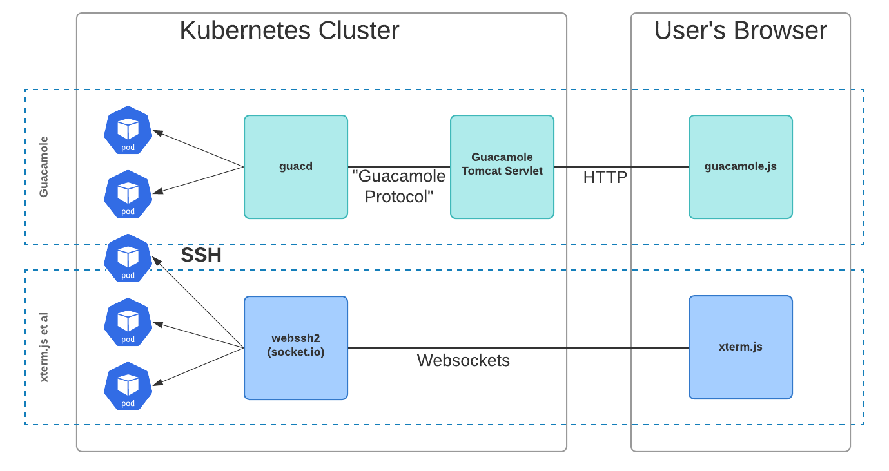

# Antidote Blueprint - Replacing Guacamole

The concept of having a fully-functional terminal in the browser, so that users can easily gain access to the automated learning environment we build on their behalf is fundamental to the NRE Labs project. Getting hands-on experience, but with the ease-of-use of reading a blog post, is primarily enabled through this technology.

Recently, we engaged with a consultancy to re-build `antidote-web` to bring it up to modern web development standards, which includes not only a totally new look and feel, but also puts that project on much better footing, with a much more well-thought-out functional implementation and a totally responsive design.

One of the final holdouts to accomplishing our goals turns out to be the technology we originally selected to give us the terminal in the browser - Guacamole. While this technology has certainly proven to be valuable in getting us to where we are now, it has shown - especially in recent months - that there are a number of reasons why Guacamole is not the best long-term solution for terminal functionality in the NRE Labs project.

This document will outline a proposal for replacing Guacamole with alternative software that not only addresses the shortcomings we've identified during the rewrite of `antidote-web`, but also will benefit the project as a whole in ways that might not immediately be obvious.

## History of Guacamole in NRE Labs

Very early during the development of NRE Labs, an acquaintance of mine pointed out the [Apache Guacamole](https://guacamole.apache.org/doc/gug/guacamole-architecture.html) project. He indicated that it had a client-side javascript library we could use, combined with a servlet that proxied connections to the front-end, so we didn't have to expose our network devices directly to the internet. On top of that, Guacamole supported not only SSH, but also VNC and RDP. Given that this phase of the project was all about moving fast and getting to a PoC so we could start building the curriculum and perfecting that side of things, seeing that there was an open source project that was ready-to-use, that not only supported our immediate needs but also gave us VNC/RDP capabilities when we wanted to use it seemed like a slam-dunk.

And it was - this decision proved to be the right one. Implementing guacamole in `antidote-web` meant we were able to quickly turn our attention to other areas of the project that needed it desperately - namely, the creation of Syringe, which ended up being the most important component - the thing that got us curriculum-as-code, and on-demand lesson provisioning. For the next year, Guacamole for the most part has done its job well, and has managed to grow with the project.

## Pain points

However, using Guacamole in NRE Labs hasn't been without its problems. Especially within the last few months a few drawbacks have made themselves evident.

- **Guacamole traffic is very inefficient** - By default, Guacamole sends a **lot** of traffic for every keystroke. This means that on the best of connections, it's passable. On mobile connections, or otherwise poor internet connections, forget about it. Imagine typing and then having your keystrokes show up seconds later. This *could* be addressed by using Websockets, but that leads into the next pain point.

- **Documentation is scarce, or confusing** - There's not really a shortage of Guacamole documentation - if you google for various Guacamole topics, you may get what you need, but you may not. When researching moving to websockets instead of the inefficient HTTP calls, it was hard to get the information I needed. Since Guacamole is canonically meant to be deployed as an off-the-shelf application, I wonder that the documentation focuses much more on that use case, and less on folks that want to use the more fundamental components. Lastly, I'd often Google for information on a topic, and there would be results pointing to a JIRA site, but when I navigate to those links, the site would never load. It's as if they allowed Google to index their JIRA site but block everyone else.

- **Doesn't integrate well with the rest of `antidote-web`** - This is partially an observation I'm making, as well as one by the web development company we've engaged to help with the heavy lifting. This manifests itself in a few ways. One of which is the lack of client-side style controls (which tbh may be there but again the docs are light in this area). Another is just getting input into the terminal control - on PCs this isn't a problem, but on moble, the guacamole terminal doesn't register with the browser as an input, so the keyboard never shows up. Just to get this working minimally, we'd have to do some kind of tricks with hidden textboxes that automatically copy their text into the terminal. 

- **Server-side performance issues** - This has manifested in a few ways. One of which is that even on multiple Guacamole versions, memory leaks continue to be a problem. We've had to set up cron tasks to restart these pods on nearly a nightly basis. In addition, while in production this isn't a problem, on selfmedicate, we've had horrible experiences just typing into the terminal when interacting with a lesson with a few tabs.

- **Hard to maintain integration due to diverse technologies** - The NRE Labs project is itself a large project, and there's always more work than there are people to do it. One thing that's counting against us in this area is selecting external dependecies that fall outside of the core competency of the project contributors/committers. Guacamole has a few components that are written in languages that are not used in any other part of the project, and therefore it's harder to find folks that are willing or able to help maintain our integration with it. This means Guacamole inevitably ends up being more of a black-box that everyone's afraid to touch.

While we've been contemplating alternatives for a few weeks or even months, the company we've hired to give `antidote-web` a much-needed facelift is giving us the last push we need to finally pull the trigger on replacing Guacamole. So that's what we're going to do.

## New Solution Powered by xterm.js

The good news is there's a project out there that is not only much more well-aligned with our goals and capabilities, but it already has a place in NRE Labs' origin story. Early on in the project, we considered using [`xterm.js`](https://xtermjs.org/), and even built an early prototype with it, before deciding to move to the combined server and client architecture of Guacamole.

`xterm.js` is actually a very popular solution for using the terminal in the browser. More popular than Guacamole, even. Take a look at their [documented real-world uses](https://github.com/xtermjs/xterm.js/#real-world-uses). The main drawback when looking at the project is, it doesn't seem to have a server-side component that we could use to effectively replace the servlet we got with Guacamole. This is a must-have, because without this we'd have to fundamentally change Antidote to expose SSH presentations to the internet, which is not only a bad idea, but also a significant architectural change. We need a replacement, not just for the terminal functionality in the browser, but for the entire architecture.

Fortunately it seems this is a well-worn path. [webssh2](https://github.com/billchurch/webssh2), while described as a "bare-bones example", should provide at least a basis for, if not a full solution for this problem. It contains a Node.js app that provides websocket connections to xterm.js (a vast improvement on single HTTP calls per-keystroke that we're currently doing), via [socket.io](https://socket.io/) and then proxies those streams into SSH connections. This application can be deployed in the same way we're currently deploying the `guacd` and Guacamole servlet applications:

The reason I think `webssh2` describes itself as a "bare bones example" is that it also includes an example client, which shows a single terminal in the browser using xterm.js. It's not really meant to do much beyond showing basic capabilities. However, since our xterm.js implementation will be contained fully in `antidote-web`, we won't actually need to use this. For our purposes, the server-side component of `webssh2` can be deployed on its own, as a standalone service within our cluster, for the sole purpose of translating websocket streams to SSH connections. As a result, `antidote-web` will transition to a pure HTML/CSS/JS application, requiring no servlets or other server-side logic whatsoever to be maintained as part of that project. This is a much simpler, and cleaner solution.

This solution has a few key benefits for the project:

- `xterm.js` is a much more widely used terminal-in-browser solution. It doesn't push an end-to-end solution, but rather allows us to build the experience we want from base components. This gives us more flexibility to customize to fit our needs.
- The entire solution (both client and server) is written in Javascript, which is in contrast to the combination of C, Java, and Javascript that Guacamole uses. This means it's much easier for web-savvy community members to contribute, and lets us treat the solution less like a black-box.
- A drastic reduction in footprint and increase in performance will make it *much* easier to preview lesson content in selfmedicate. We've determined that the existing solution is actually a significant impediment to building lesson content, and fixing this should result in a better experience there, greatly boosting curriculum contribution engagement.
- A much lighter-weight transport (websockets) combined with much better support for modern web standards means the terminal will no longer be an impediment to strong mobile support. Given that this work is taking place within the context of a larger project to re-vamp `antidote-web` as a whole, I view this as the final step in moving towards officially supporting mobile with this project (finally!)
- The components used in this solution each have really great documentation, and are all very active, welcoming projects. I opened a PR to `webssh2` to introduce a security feature we'd want to have in place for this project, and [it was merged in less than a day](https://github.com/billchurch/webssh2/pull/163). To me, this gives me the warm and fuzzies about relying on them as dependencies, and aligns well with the true spirit of open source - projects mutually improving each other.

## Work Execution Plan

This is the best part of the plan. All of the work needed to implement the server-side functionality using `webssh2` is already done. In researching this solution, I've already deployed this service to our cluster, and it works well.

The only work remaining is to replace the existing Guacamole JS implementation in `antidote-web` with `xterm.js`. This is already part of a proposal for the next phase of work that will be done as part of the `antidote-web` re-vamp, so if all goes well, this will be done in the next month or so, and ready to get rolled into the next version of Antidote.

I anticipate that the biggest piece of work we'll need to take on is extensive testing. This is a significant architectural change to a project that has a significant number of production users, and before going live with these changes, we'll want to have them deployed to a test site, and spend at least a few weeks going through every nook and cranny to ensure the experience is not only up to par, but makes the improvements we've been seeking.

## What about RDP and VNC?

To be clear, one thing we're definitely giving up by moving away from Guacamole is the automatic support for VNC and RDP. While we don't have any Endpoint images today that could make use of this, it's been brought up several times that being able to show desktop applications like Wireshark could prove a very powerful tool to use in a lesson.

In this case, I feel strongly that it will be easy enough to find alternatives that give us this functionality down the road, that are focused on this particular use case and do it well. Especially in the world of VNC, there are [several tools for using VNC in the browser](https://www.realvnc.com/en/news/control-computer-within-your-web-browser/). Long-story short, we're not currently pressed for VNC functionality, but when the time comes, I know we will be able to find the alternatives we're looking for.

## Loose Threads

These are some open discussions on this topic that will need to be linked here.

- https://community.networkreliability.engineering/t/web-terminal-emulator-replacement/184
- https://community.networkreliability.engineering/t/guacamole-proxy-only-for-ssh-or-vnc-too/44
- [Support VNC Connections Too](https://github.com/nre-learning/antidote-web/issues/65)
